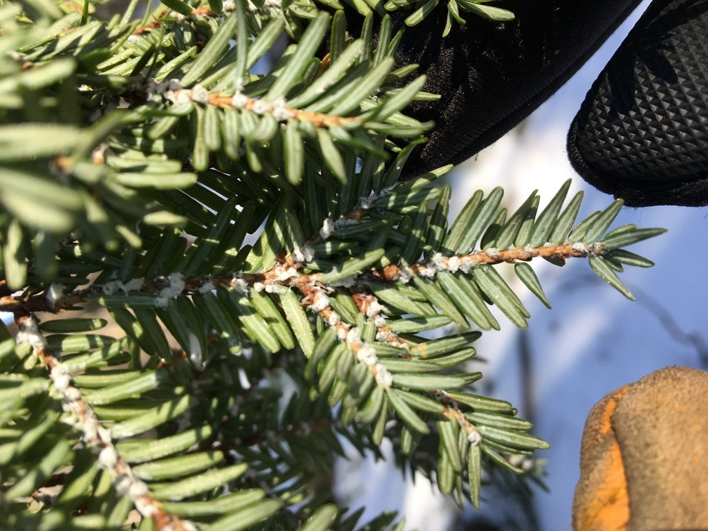

```{r setup, include = FALSE}

# Global options and library loading
knitr::opts_chunk$set(echo = FALSE, warning = FALSE, message = FALSE)
library(tidyverse)
library(lubridate)
library(kableExtra)
library(htmltools)
library(sf)
library(gt)
library(downloadthis)
source("email_alerts/email_functions.R")


start <- format(today() - 7, "%d %B %Y")
end <- format(today()-1, "%d %B %Y")


## Pull iNaturalist and eBird data
# inat <- inat_recent("17", "week")
# ebird <- ebird_recent("US-ME")


# ## Run the three function and combine rows for iNaturalist
# inat_twf <- bind_rows(inat %>% watchlist_inv(), inat %>% watchlist_te(),
#                          inat %>% watchlist_rn()) %>%
#   mutate(observed.on = as.character(observed.on))
# 
# ## Run the three function and combine rows for eBird
# ebd_twf <- bind_rows(ebird %>% watchlist_inv(), ebird %>% watchlist_te(),
#                       ebird %>% watchlist_rn())


## Add to the full database and export
# if(nrow(inat_twf) > 0) {
# read.csv("email_alerts/www/datasets/inat_fulldata.csv") %>%
#   bind_rows(inat_twf) %>%
#   select(-c(datetime:count)) %>%
#   write.csv(., "email_alerts/www/datasets/inat_fulldata.csv", row.names = F)
# }
#
# if(nrow(ebd_twf) > 0) {
# read.csv("email_alerts/www/datasets/ebd_fulldata.csv") %>%
#   bind_rows(ebd_twf) %>%
#   select(-c(speciesCode:license)) %>%
#   write.csv(., "email_alerts/www/datasets/ebd_fulldata.csv", row.names = F)
# }


## Make a df with 'groups' to add to the data
groups <- data.frame(iconic.taxon.name = c("Plantae", "Mammalia", "Animalia", "Aves", "Insecta",
                                 "Reptilia", "Amphibia", "Fungi", "Protozoa", "Chromista",
                                 "Arachnida", "Mullusca"),
           groups = c("Plants", "Mammals", "Other animals", "Birds", "Insects", "Reptiles",
                      "Amphibians", "Fungi and lichens", "Protozoans", "Kelp and seaweeds",
                      "Spiders", "Mullusks"))


## Combine the two data frames
# final_data <- combine_citsci_data(
#   inat %>%
#     select(scientific.name, common.name, iconic.taxon.name, observed.on,
#            place.guess, latitude, longitude, positional.accuracy, user.login,
#            user.id, captive.cultivated, url, image.url, license, presv_name),
#   ebird %>%
#     select(scientific.name, common.name, iconic.taxon.name, count, observed.on,
#            place.guess, latitude, longitude, checklist, url, presv_name),
#   join = groups) %>%
#   rename(preserve = presv_name)


## Run the summary function on the final data
# watchlist_species(final_data, "email_alerts/outputs")


## Prepare distinct preserve names for filter input
preserve_list <- sort(unique(read.csv("email_alerts/www/datasets/mcht_preserve_information.csv")$presv_name))


## Read in the outputs from the watchlist + new npspecies functions and format for tables
pests <- process_species("email_alerts/outputs/invasive_pestslist.csv")
rare <- process_species("email_alerts/outputs/rare_specieslist.csv")
te <- process_species("email_alerts/outputs/te_specieslist.csv", extra_cols = "listing.status")


## Combine for map
pestsmap <- read.csv("email_alerts/outputs/invasive_pestslist.csv") %>% 
  select(scientific.name, common.name, latitude, longitude, url) 
raremap <- read.csv("email_alerts/outputs/rare_specieslist.csv") %>% 
  select(scientific.name, common.name, latitude, longitude, url) 
temap <- read.csv("email_alerts/outputs/te_specieslist.csv") %>% 
  select(scientific.name, common.name, latitude, longitude, url) 
mapcomb <- rbind(pestsmap, raremap, temap)


# ## Define reactive expressions for the filtered dataframes
# ## These will reactively filter the full datasets based on `input$preserve`
# pests_reactive <- reactive({
#   req(input$preserve) # Ensure input$preserve is available
#   pests %>% filter(preserve == input$preserve)
# })
# 
# rare_reactive <- reactive({
#   req(input$preserve)
#   rare %>% filter(preserve == input$preserve)
# })
# 
# te_reactive <- reactive({
#   req(input$preserve)
#   te %>% filter(preserve == input$preserve)
# })


# # Map data reactive:
# mapcomb <- reactive({
#   
#   mappest <- pests() %>% select(scientific.name, common.name, latitude, longitude, url)
#   maprare <- rare() %>% select(scientific.name, common.name, latitude, longitude, url)
#   mapte <- te() %>% select(scientific.name, common.name, latitude, longitude, url)
#   
#   bind_rows(mappest, maprare, mapte)
# })
  
```


<!-- Top Button -->
<a href = "#"></a>


<!-- Header -->
<div class = "title-box">
  <div class = "title-text-box">
  
  <div class = "h1 header-text">
  MCHT Property Stewards' Report
  </div>
  <div class = "h2 header-text">
  A citizen science early-detection summary
  </div>
  
  <div class = "headerp">
  Welcome to the weekly early detection report of observations submitted by iNaturalist and eBird users. These are all observations submitted over the past week for species that Maine Coast Heritage Trust property stewards have identified as being of conservation interest. These data for this report comes from two of the largest open source citizen science projects: iNaturalist and eBird. The records included in this report include both casual and research grade observations, so erroneous identifications are possible. Stewards should double check the identification of species to ensure they are correct.
  </div>
  
  <div class = "header-date"> 
  `r start` - `r end`
  </div>
  
  </div>
</div>


<!-- #### All Things Body ##### -->
<div class = "thebody">


<!-- Observations Map -->
<div class = "map-box">
  <div>
  <h3 class = "boxtitles titlemap"> Explore Species Locations </h3>
  `r leaflet_summary(mapcomb)`
  </div>
</div>


<!-- Invasive Species -->
<div class = "species-box">
  <div>
  <h3 class = "boxtitles"> Invasive Species </h3>
  </div>
  
  <h5 class = "cite"> © Jesse Wheeler </h5>
  <div class = "sp-table shrink-table">
```{r pests-table, results='asis', echo = FALSE}
if (nrow(pests) > 0) {
  pests %>%
    select(-c(latitude, longitude, preserve)) %>% 
    kbl(col.names = c("Scientific Name", "Common Name", "Date Observed", "Link")) %>%
    kable_styling(bootstrap_options = "hover")
} else {
  cat("<h3>There were no invasive species reported this week.</h3>")
}
```
  </div>
</div>


<!-- Rare Species -->
<div class = "species-box">
  <div>
  <h3 class = "boxtitles"> Rare Species </h3>
  </div>
  
  <h5 class = "cite cite-white"> © Andy Fyon </h5>
  <div class = "sp-table shrink-table">
```{r rare-table, results='asis', echo = FALSE}
if (nrow(rare) > 0) {
  rare %>%
    select(-c(latitude, longitude, preserve)) %>% 
    kbl(col.names = c("Scientific Name", "Common Name", "Date Observed", "Link")) %>%
    kable_styling(bootstrap_options = "hover")
} else {
  cat("<h3>There were no rare species reported this week.</h3>")
}
```
  </div>
</div>


<!-- Threatened & Endangered Species -->
<div class = "species-box">
  <div>
  <h3 class = "boxtitles"> Threatened & Endangered Species </h3>
  </div>
  
  <h5 class = "cite"> © Fyn Kynd </h5>
  <div class = "sp-table shrink-table">
```{r te-table, results='asis', echo = FALSE}
if (nrow(te) > 0) {
  te %>%
    select(-c(latitude, longitude, preserve)) %>% 
    kbl(col.names = c("Scientific Name", "Common Name", "Date Observed", "Listing", "Link")) %>%
    kable_styling(bootstrap_options = "hover")
} else {
  cat("<h3>There were no threatened or endangered species reported this week.</h3>")
}
```
  </div>
</div>


</div>


<!-- Footer -->
<div class = "footer-box">
<div class = "footer-content">
<div class = "footer-si">
  
  <p><i>Our Mission is inspiring science, learning, and community for a changing world.</i></p>
</div>
<div>
  <h1>About</h1>
  <p><a href = "https://github.com/Kylelima21/MCHT_early_detection_system" target="_blank">Source code</a></p>
  <p><a href = "https://schoodicinstitute.org/" target = "_blank">Visit our website</a></p>
</div>
</div>
<div class = "copyright">
  <p>&copy; `r format(Sys.Date(), "%Y")` Schoodic Institute</p>
</div>

